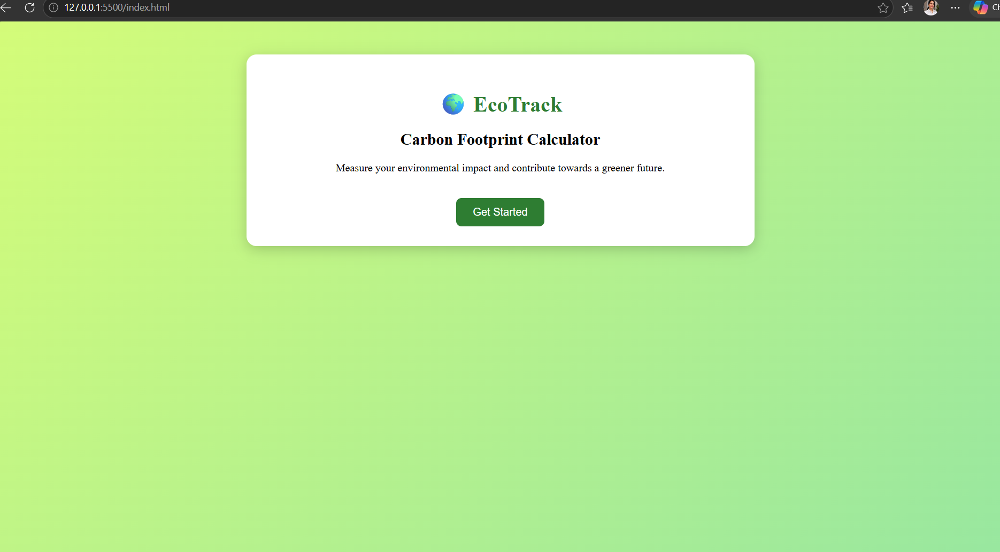
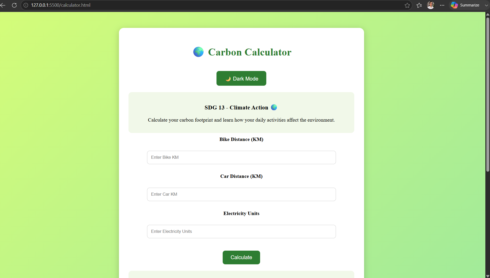
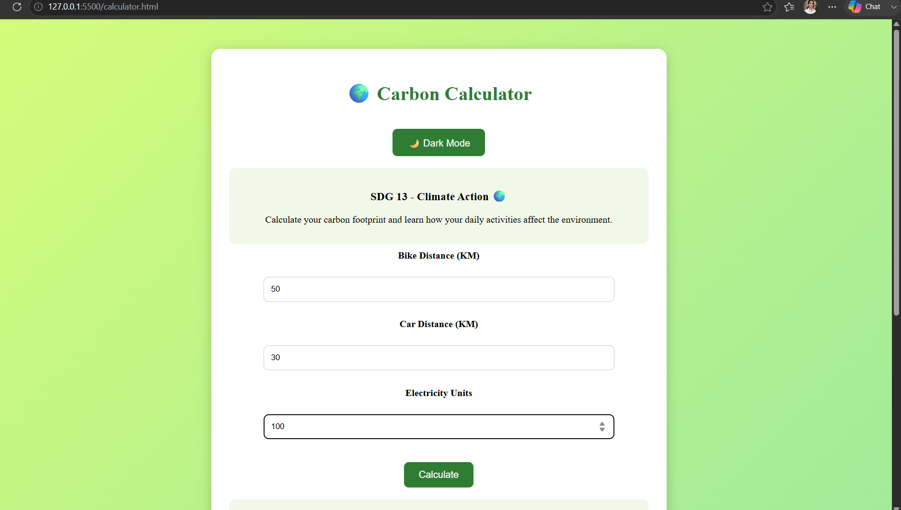
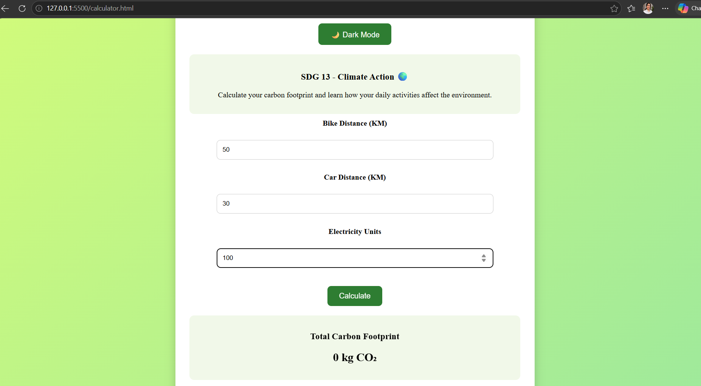
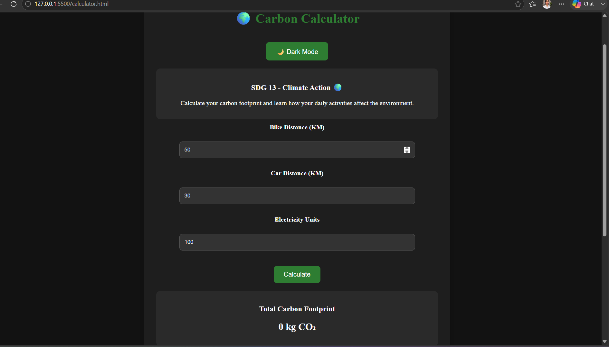
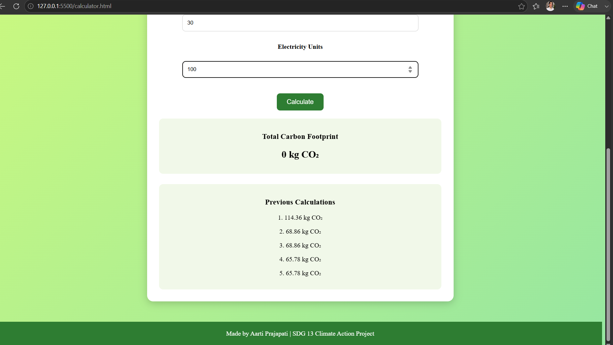

# 🌍 EcoTrack - Carbon Footprint Calculator

A web-based Carbon Footprint Calculator developed to support **SDG 13: Climate Action**. This project helps users estimate their carbon emissions based on transportation and electricity usage while promoting eco-friendly habits.

---

# 🎯 SDG Goal

## SDG 13: Climate Action

This project aligns with the United Nations Sustainable Development Goal 13 by raising awareness about carbon emissions and encouraging environmentally responsible behavior.

---

# 📌 Problem Statement

Many people are unaware of the environmental impact of their daily activities such as transportation and electricity consumption.

As a result, carbon emissions continue to increase, contributing to climate change and environmental degradation.

---

# 💡 Solution

EcoTrack is a web application that calculates a user's carbon footprint based on transportation and electricity usage.

The system analyzes user inputs and provides:

- Carbon Footprint Calculation
- Carbon Level Detection
- Eco-Friendly Suggestions
- Emission Awareness
- Carbon History Tracking

---

# ✨ Features

- 🌱 Carbon Footprint Calculator
- 🚲 Bike Distance Tracking
- 🚗 Car Distance Tracking
- ⚡ Electricity Consumption Tracking
- 📊 Carbon Level Detection
- 💚 Eco-Friendly Suggestions
- 🕒 Calculation History Tracking
- 🌙 Dark Mode
- 📱 Responsive Design
- 🌍 SDG 13 Awareness Section

---

# 🛠️ Technologies Used

- HTML5
- CSS3
- JavaScript
- Local Storage

---

# 📊 Carbon Calculation Logic

### Bike Emission

```text
Bike Emission = Bike KM × 0.08
```

### Car Emission

```text
Car Emission = Car KM × 0.20
```

### Electricity Emission

```text
Electricity Emission = Units × 0.82
```

### Total Carbon Footprint

```text
Total Carbon Footprint =
Bike + Car + Electricity Emissions
```

---

# 📸 Project Screenshots

## Home Page



---

## Calculator Page



---

## User Input



---

## Result Page



---

## Dark Mode



---

## History Tracking



---

# 🌱 Environmental Impact

EcoTrack encourages users to:

- Reduce unnecessary vehicle usage
- Save electricity
- Adopt eco-friendly transportation
- Lower their carbon emissions
- Contribute towards a sustainable future

---

# 🚀 Future Scope

- Graphical Dashboard
- Carbon Emission Analytics
- User Accounts
- Carbon Reduction Goals
- AI-based Recommendations
- Monthly Carbon Reports
- Mobile Application Version

---

# 📂 Project Structure

```text
EcoTrack-SDG13
│
├── index.html
├── calculator.html
├── style.css
├── script.js
├── README.md
│
├── home-page.png
├── calculator.png
├── user-input.png
├── result.png
├── dark-mode.png
└── history.png
```

---

# 👨‍💻 Developed By

### Aarti Prajapati

B.Tech CSE (AI & ML)

IIMT University

---

# ⭐ Project Objective

To create awareness about carbon emissions and motivate individuals to adopt sustainable and eco-friendly lifestyles through technology.
